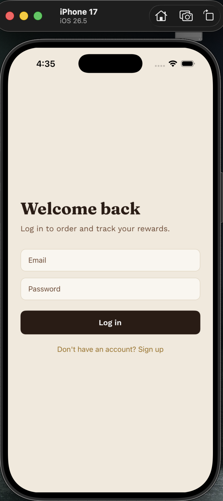
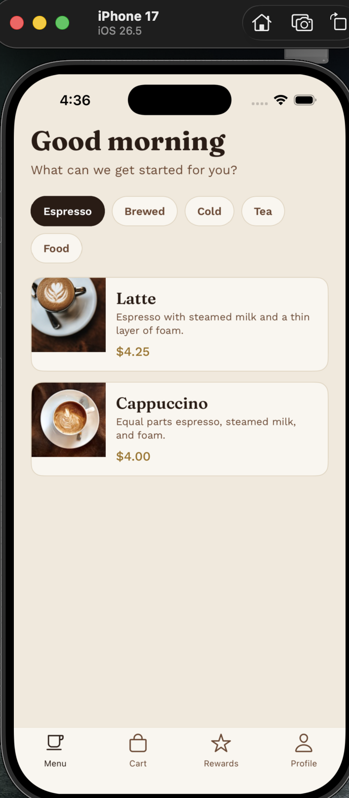
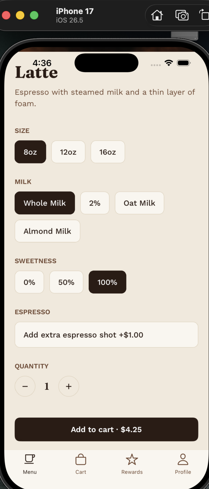
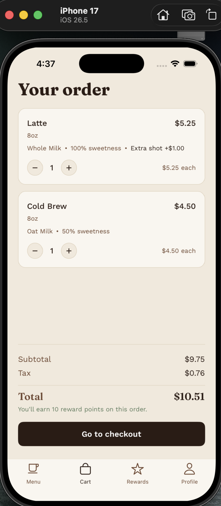
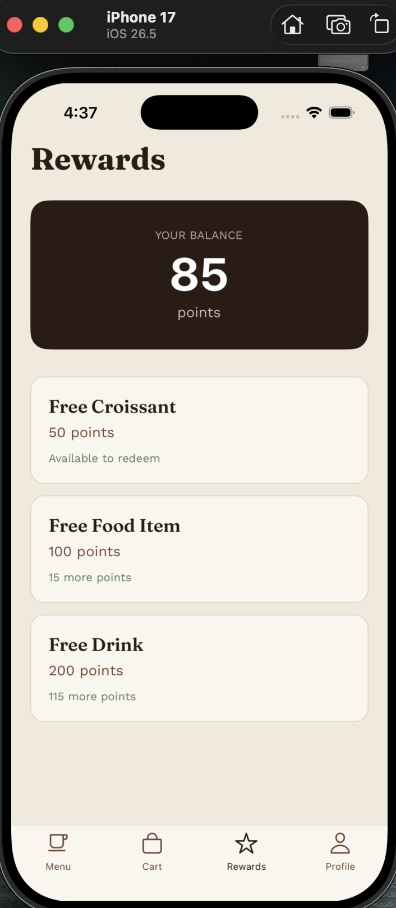
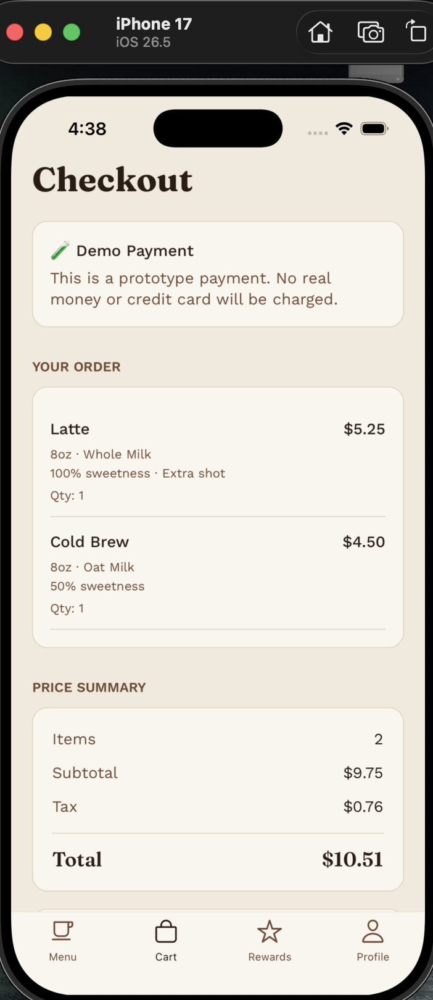
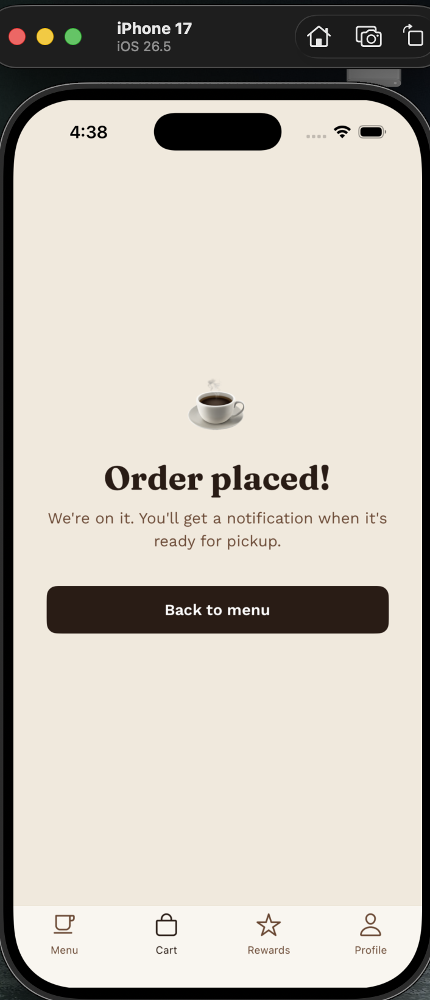

☕ Coffee Shop App

A full-stack mobile coffee ordering application built with React Native, Expo, and TypeScript. The application simulates a real-world coffee ordering experience with user authentication, product customization, shopping cart management, rewards, cloud data storage, and a Stripe test-mode payment integration.

🚧 Status: In Development

This is an actively developed portfolio project focused on building and understanding a complete mobile application architecture. Core authentication, menu browsing, customization, cart functionality, rewards, Firebase integration, and the Stripe backend payment architecture are implemented. Production-readiness improvements and additional features are still in progress.

📱 Project Overview

The Coffee Shop App was built to simulate a real-world mobile ordering platform rather than a single frontend interface.

The project demonstrates experience with:

* Mobile application development
* TypeScript and React Native
* User authentication
* Cloud database integration
* Application state management
* Shopping cart and product customization
* Backend development
* Third-party API integration
* Payment architecture
* Transaction-based database operations
* Git and GitHub version control

The application is being developed for iOS and Android using Expo and React Native.

⸻

✨ Features

🔐 User Authentication

* User registration with name, email, and password
* User login and logout
* Firebase Authentication
* User profiles stored in Firestore
* User-specific reward point balances

☕ Menu & Product Customization

* Browse coffee and food items
* Menu categories
* Product descriptions and pricing
* Multiple drink sizes
* Milk and sweetness customization
* Optional extra espresso shots
* Different customization rules for food and drinks

🛒 Shopping Cart

* Add customized products to cart
* Increase and decrease quantities
* Remove individual items
* Automatically calculate item pricing
* Calculate subtotal, tax, and total
* Combine matching customized items within the cart

⭐ Rewards System

* Earn reward points when orders are placed
* Store reward balances in Firestore
* Display available rewards based on point balance
* Reward redemption logic using Firestore transactions
* Transaction-based point updates to help prevent invalid redemptions

💳 Stripe Test-Mode Payment Integration

The application uses Stripe following a backend architecture designed to keep private payment credentials off the mobile application.

* Stripe PaymentIntent integration
* Stripe test mode for development and demonstration
* Firebase Cloud Function handles payment requests
* Stripe secret key securely managed through Firebase Secret Manager
* No real customer payments are processed

🎨 UI & Design

* Custom coffee-shop visual theme
* Reusable React Native components
* Custom typography
* Responsive mobile layouts
* Tab-based navigation
* Item detail and checkout screens

⸻

🛠️ Tech Stack

Technology	Purpose
React Native	Cross-platform mobile application development
Expo	React Native development and build tooling
TypeScript	Type-safe application development
Firebase Authentication	User authentication
Cloud Firestore	Cloud database for users and orders
Firebase Cloud Functions	Backend/serverless functionality
Stripe	Test-mode payment integration
React Navigation	Mobile application navigation
React Context	Application state management
Git & GitHub	Version control and source management

⸻

## 🏗️ Project Architecture

The project separates UI components, application state, navigation, services, business logic, types, and styling into dedicated modules.

```text
coffee-shop-app/
│
├── App.tsx
│
├── functions/
│   └── index.js
│
├── src/
│   ├── components/
│   │   ├── Button.tsx
│   │   ├── CartLineItem.tsx
│   │   └── MenuItemCard.tsx
│   │
│   ├── context/
│   │   ├── AuthContext.tsx
│   │   └── CartContext.tsx
│   │
│   ├── navigation/
│   │   ├── MainTabs.tsx
│   │   └── RootNavigator.tsx
│   │
│   ├── screens/
│   │   ├── AuthScreen.tsx
│   │   ├── CartScreen.tsx
│   │   ├── CheckoutScreen.tsx
│   │   ├── HomeScreen.tsx
│   │   ├── ItemDetailScreen.tsx
│   │   ├── OrderConfirmedScreen.tsx
│   │   ├── ProfileScreen.tsx
│   │   └── RewardsScreen.tsx
│   │
│   ├── services/
│   │   ├── authService.ts
│   │   ├── firebase.ts
│   │   ├── menuData.ts
│   │   ├── orderService.ts
│   │   ├── rewardService.ts
│   │   └── stripeService.ts
│   │
│   ├── theme/
│   │   ├── colors.ts
│   │   └── typography.ts
│   │
│   └── types/
│       └── index.ts
│
├── app.json
├── firebase.json
├── package.json
└── tsconfig.json

⸻

🔥 Firebase Architecture

Firebase provides authentication, cloud data storage, and backend functionality.

Authentication

Users authenticate through Firebase Authentication using email and password.

Firestore

Firestore currently stores application data including:

users/
  └── user profile + reward points
orders/
  └── order information + cart items + status

The application uses Firestore transactions for reward redemption so point balances can be checked and updated atomically.

⚠️ Production Note: Firestore security rules require additional hardening before the application should be used with real users.

⸻

💳 Stripe Payment Architecture

The payment integration follows a backend architecture where the mobile application does not contain the Stripe secret key.

React Native App
       │
       │ Payment Request
       ▼
Firebase Cloud Function
       │
       │ Stripe Secret Key
       ▼
Stripe API
       │
       ▼
PaymentIntent
       │
       ▼
React Native App

The Stripe secret key is securely managed through Firebase Secret Manager rather than being hardcoded into the mobile application.

The project currently uses Stripe test mode to demonstrate the integration and payment architecture. No real customer payments are processed.

This project demonstrates experience integrating a third-party API through a backend service while separating client-side and server-side responsibilities.

⸻

🚧 Development Progress

Completed

* React Native / Expo application
* TypeScript project structure
* Custom UI theme
* User registration
* User login
* Firebase Authentication
* Firestore user profiles
* Coffee and food menu
* Product customization
* Shopping cart
* Quantity management
* Order calculations
* Reward point calculation
* Reward redemption service
* Firestore transaction logic
* Firebase Cloud Function backend
* Stripe test-mode payment architecture
* Git/GitHub version control

In Progress

* Complete end-to-end payment flow
* Connect reward redemption directly to checkout
* Build order history
* Move menu data into Firestore
* Improve Firestore security rules
* Add persistent authentication state
* Expand automated testing
* Production deployment preparation

⸻

🎯 Future Improvements

Planned improvements include:

* Push notifications for order status
* Store/location selection
* Favorite menu items
* Order history
* Reward redemption during checkout
* Coupon and promotional codes
* Improved error handling
* Automated testing
* Improved accessibility
* Production Firebase security rules
* iOS and Android production builds

⸻

🚀 Getting Started

Prerequisites

You will need:

* Node.js
* npm
* Expo
* A Firebase project
* iOS Simulator/device or Android emulator/device

Installation

Clone the repository:

git clone https://github.com/Gregpesina/coffee-shop-app.git
cd coffee-shop-app

Install dependencies:

npm install

Start the Expo development server:

npx expo start

The application can then be launched using an iOS Simulator, Android emulator, or compatible physical device.

⸻

🔐 Security & Environment

Sensitive credentials should never be committed to GitHub.

The Stripe secret key is managed through Firebase Secret Manager and is not hardcoded into the mobile application.

Before deploying the application for real users, additional security work is required, including:

* Production Firestore security rules
* Secure environment configuration
* Production Stripe configuration
* Authentication and database access testing
* Additional backend validation
* Production credential management

⸻

## 📸 Screenshots

Here are some of the main screens from the application.

<table>
  <tr>
    <td align="center">
      <strong>🔐 Login & Sign Up</strong><br>
      
    </td>
    <td align="center">
      <strong>☕ Coffee Menu</strong><br>
      
    </td>
  </tr>
  <tr>
    <td align="center">
      <strong>🥛 Item Customization</strong><br>
      
    </td>
    <td align="center">
      <strong>🛒 Shopping Cart</strong><br>
      
    </td>
  </tr>
  <tr>
    <td align="center">
      <strong>⭐ Rewards</strong><br>
      
    </td>
    <td align="center">
      <strong>💳 Checkout</strong><br>
      
    </td>
  </tr>
  <tr>
    <td align="center">
      <strong>✅ Order Confirmation</strong><br>
      
    </td>
    <td></td>
  </tr>
</table>


⸻

📚 Technical Skills Demonstrated

Through this project, I have gained hands-on experience with:

* TypeScript
* React Native
* Expo
* Component-based architecture
* React Context state management
* Firebase Authentication
* Cloud Firestore
* Firebase Cloud Functions
* Firestore transactions
* Stripe API integration
* Backend/serverless architecture
* Third-party API integration
* Git & GitHub
* Debugging and troubleshooting
* Application architecture
* Real-world user workflow design

⸻

👨‍💻 Developer

Greg Pesina

Computer Science student developing practical experience in software engineering, mobile application development, and full-stack technologies.

⸻

Project Status: 🚧 Actively maintained and under development